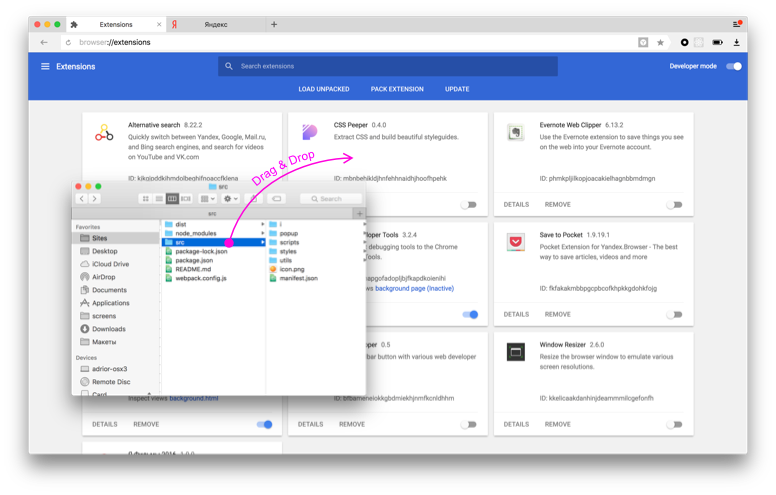
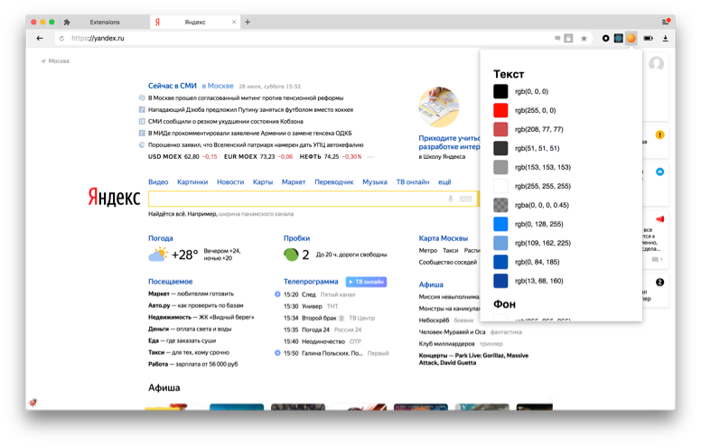

# Демо расширения для ревизии цветов веб-страницы

## Как использовать?

1.  Скачай репозиторий
2.  Зайди в Яндекс.Браузере `browser://extensions/`
3.  Перетащить туда папку `src` из репозитория
4.  Отррыть любую страницу в браузере (если была открыта — перезагрузить)
5.  Кликнуть по иконке расширения

